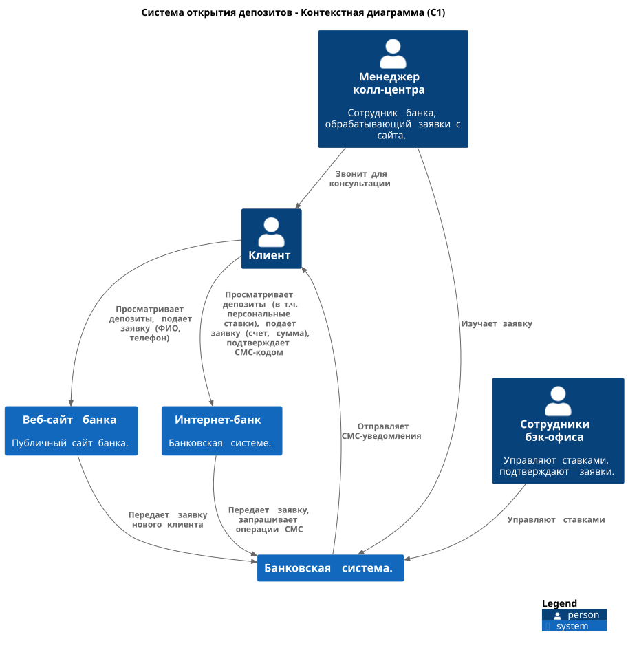
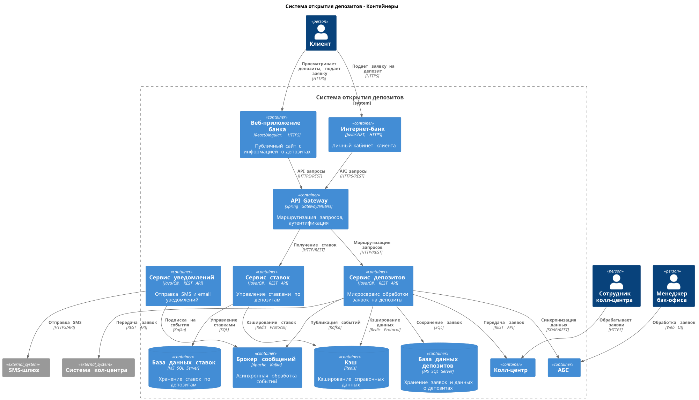

### **Название задачи:**  Открытие депозита в интернет банкинге 
### **Автор:** Архитектор Архитекторович
### **Дата:** 2025-05-28
### **Функциональные требования**

|**№**|**Действующие лица или системы**|**Use Case**|**Описание**|
| :-: | :- | :- | :- |
|||||
1| Клиент | Клиент видит доступные депозиты с актуальными ставками на сайте | 1. Клиент заходит на сайт  2. Клиент видит доступные депозиты с актуальными ставками
2| Клиент | Клиент подает заявку на сайте на депозит | 1. Клиент заходит на сайт  2. Клиент видит доступные депозиты с актуальными ставками. 3. Клиента подает заявку
3| Клиент | Клиент видит доступные депозиты с актуальными ставками в интернет банкинге | 1.Клиент заходит в интернет банкинг 2. Клиент видит доступные депозиты с актуальными ставками
4| Клиент | Клиент подает заявку на депозит в интернет банкинге с указанием счета и депозита | 1. Клиент заходит в интернет банкинг 2. Клиент видит доступные депозиты с актуальными ставками 3. Клиент подает заявку на депозит 4. Клиент указывает счет и депозит| 
5| Клиент | Клиент подтверждает операцию с помощью смс |  1. Клиент оставляет заявку на сайте или в интернет банкинге 2. Клиент получает смс с кодом подтверждения 3. Клиент вводит код в специальное поле на сайте или в интернет банкинге
6| Сотрудник депозитов | Сотрудник депозитов может работать со ставками | 1.Сотрудник заходит в АБС или Систему управления депозитами 2. Сотрудник видит ставки по депозитам 3. Сотрудник может изменять ставки по депозитам
7| Сотрудник кредитов | Сотрудник кредитов может работать со ставками | 1.Сотрудник заходит в АБС или Систему управления кредитами 2. Сотрудник видит ставки по кредитам 3. Сотрудник может изменять ставки по кредитам
### **Нефункциональные требования**
Опишите здесь нефункциональные требования и архитектурно значимые требования.

|**№**|**Требование**|
| :-: | :- |
|||
1|Отклик по всем операциям должен быть максимально быстрым и занимать миллисекунды 
2|Шифрование трафика
3|При этом все сервисы должны работать 24/7 и быть доступны в 99,9% случаев
4|Использовать технологии, которые уже есть в банке
5|Чтобы внутри банка уже была экспертиза — сотрудники понимали новые технологии хотя бы на уровне языков программирования
6|Предусмотреть разработку документации для дальнейшего расширения системы
7|Предусмотреть равномерное горизонтальное масштабирование и распределение запросов между серверами, приложениями и ЦОД
8|Придерживаться системы дизайна для приложений, которая принята в компании 
9|Базы данных MS SQL и Oracle.
10|Если нужны очереди сообщений, то лучше использовать Kafka на перспективу
11|Перевод интернет-банка на микросервисную архитектуру
12|Придерживаться системы дизайна для приложений, которая принята в компании
13|АБС может масштабироваться только вертикально из-за своей базы данных
14|Шифрование трафика 
15|Интерфейс работы будет максимально удобным для клиента
16|Пользователи при работе должны видеть привычные цвета и брендированные элементы    

### **Решение**
Приведите диаграммы контекста и контейнеров в модели C4. Опишите там основные компоненты и интеграции всех элементов решения. 

Вынос сервисов депозитов из АБС. Использование микросервисной архитектуры. Использование кафки, так как есть требования. Из технологий Java, Базы MS SQL так как есть требование. 

### **Альтернативы**
Возможно отказаться от кафки в целом, если нет экспертизы. Возможно использование другого языка .NET для сервисов. Возможно собрать в один сервис депозиты и ставки депозитные. 

**Недостатки, ограничения, риски**

Кафка, возможно оверхед для этой системы, только если потом юзать в целом для банка. Микросервисы могут стать проблемой из-за того, что нет экспертизы у команды. 
