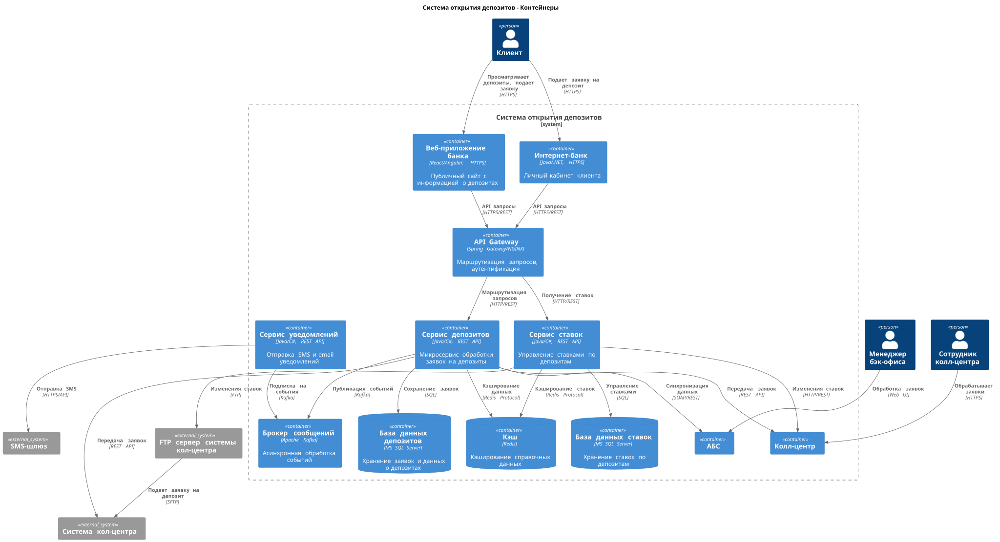

### **Название задачи:**  Добавить данные по ставкам в колл-центр и внешний колл-центр
### **Автор:** Архитектор Архитекторович
### **Дата:** 2025-05-28
### **Функциональные требования**

|**№**|**Действующие лица или системы**|**Use Case**|**Описание**|
| :-: | :- | :- | :- |
|||||
1| Сотрудник колл-центра | Сотрудник колл-центра видит ставки по депозитам | 1. Сотрудник в своей системе видит ставки по депозитам
2| Сотрудник партнерского колл-центра | Сотрудник партнерского колл-центра видит ставки по депозитам | 1. Сотрудник в своей системе видит ставки по депозитам

### **Нефункциональные требования**
|**№**|**Требование**|
| :-: | :- |
|||
1| Партнерский колл центр должен получать актуальные ставки в виде файлов. Нет возможности сделать API-вызовы (например, через SFTP-протокол).
### **Решение**

Добавлена передача данных в наш колл-центр по http. Для внешнего колл-центра добавлена передача данных по SFTP в сервис ставок. 
### **Альтернативы**
Можно вынести передачу SFTP данных в отдельный сервис. 

**Недостатки, ограничения, риски**

